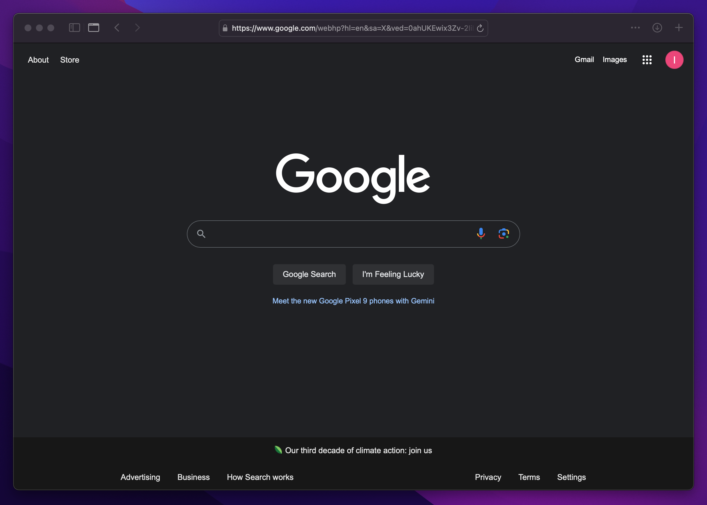
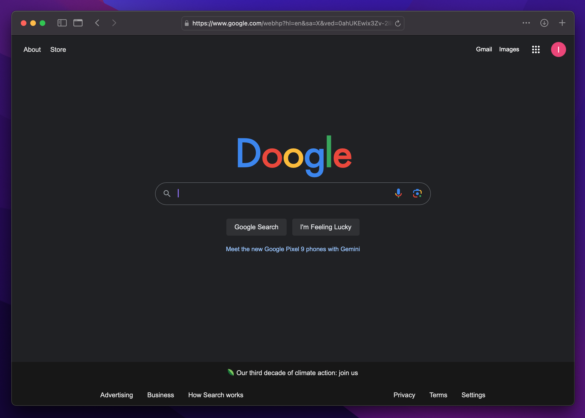
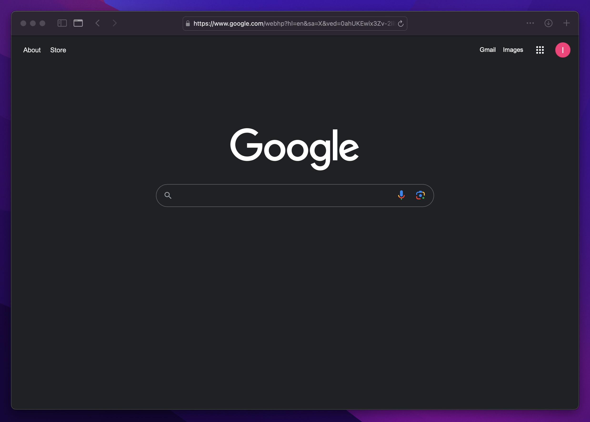

# Userscripts
A collection of userscripts I've made to make the internet a better place.

# Google Doogle
Changes the Google logo to a random misspelling like "Doogle" on google.com and subdomains. Also updates the page title. 

I made this because I got tired of Google changing their logo all the time for "National Cookie Day" and other stuff no one cares about. When you need to do some serious research, don't be distracted by Google doodles. Doogle it with yoogle. 

  
  

# Declutter Google
This script removes annoying and unnecessary elements from the Google homepage, like the "I'm Feeling Lucky" button, promotional messages, etc. 

  
  

